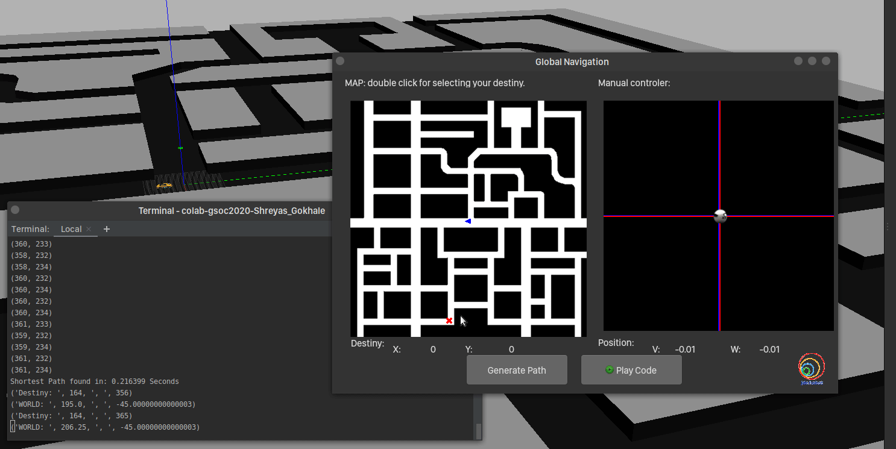

# Global Navigation Path Planning

To get accustomed to the academy exercises, I wanted to start with an exercise which is somewhat familiar, yet challenging.
Path planning is a typical problem in CS and it is used at various (and sometimes, [quite unusual](https://www.researchgate.net/publication/267809499_A-based_Pathfinding_in_Modern_Computer_Games) ! ) places.
Similarly, motion planning is important to actually follow path in a sequence.
 
The exercise I selected [Global Navigation](https://jderobot.github.io/RoboticsAcademy/exercises/AutonomousCars/global_navigation/) 
exercise which combines path planning with motion planning. 

## Pre Processing

As usual, I started by setting my environment
- Configured PyCharm for the repo
- Created and set up pip venv for easy access 
- Created a `requirements.txt` file for future installs (in case pyqt5 of problem, use this -> 
[https://stackoverflow.com/questions/18042919/how-to-install-pyqt5-on-a-new-virtualenv-and-work-on-an-idle](https://stackoverflow.com/questions/18042919/how-to-install-pyqt5-on-a-new-virtualenv-and-work-on-an-idle) )


### Understanding APIs
Listing various APIs mentioned on the page: 

#### Base APIs

- `sensor.getRobotX()` - to obtain the position of the robot
- `sensor.getRobotY()` - to obtain the position of the robot
- `sensor.getRobotTheta()` - to obtain the orientation of the robot with respect to the map
- `vel.setV()` - to set the linear speed
- `vel.setW()` - to set the angular velocity

#### Grid APIs

- `grid.getMap()` - returns the image of the map that is being displayed. The image returned will be a 3-channel image with values 0 or 255, where 0 represents the obstacles and 255 the road. Although the image has 3 channels, for this practice it will be useful to use only one.
- `grid.getDestiny()` - returns the selected destination through the GUI as a tuple (x, y).
- `grid.getPose()` - returns the position with respect to the map, not with respect to the world, also as a tuple (x, y).
- `grid.showGrid()` - creates a window in which represents the values ​​of the field that have been assigned to the grid. The smaller values ​​will have a color closer to black, and will become clearer as larger values ​​are involved. For the representation, a copy of the grid is made and its values ​​are normalized so that they are between 0 and 1, and it is represented later with cv2.imshow().
- `grid.getVal(x, y)` - returns the value in that grid position.
- `grid.setVal(x, y, val)` - sets the value val to the indicated position.
- `grid.setPathVal(x, y, val)` - sets the value val to the indicated position.
- `grid.getPathVal(x, y)` - returns the value of the indicated position.
- `grid.setPathFinded()` - establishes that the path has been found to start painting.
- `gridToWorld(gridX, gridY)` - receives the x and y components of the coordinates of the map and returns a tuple with the equivalent coordinates in the world: (worldX, worldY)
- `worldToGrid(worldX, worldY)` - receives the x and y components of the world coordinates and returns a tuple with the equivalent coordinates in the map: (gridX, gridY)


I executed a few to understand the structures

#### **Responses**

```python
self.grid.getMap() = [[29 13 17 ... 17 12 32]
                        [14 0 0 ... 0 0 17]
                        [14 0 0 ... 0 0 17]
                        ...
                        [14 0 0 ... 0 0 17]
                        [14 0 0 ... 0 0 16]
                        [28 12 17 ... 16 12 31]]

self.grid.getDestiny() = (274, 27)
self.grid.getPose() = (200, 200)
```

This confirmed a few things:

- The Map will _probably_ need a conversion to binary representation.
- The co-ordinates of destination and source are flipped (or if you consider the other way, the map is flipped)
- The whole map is visible, hence the algorithm **must** either return the path or the point is non-traversable.
- As the maze is connected, ( and is not disjoint at some places) we can safely say that white point (255) is traversable.

## Path planning algorithm

As described on the exercise page, we can either solve this using gradient path planning and sampling
based path planning. Both have their positives and negatives and either are preferable in specific scenarios.
As the exercise was already solved using Gradient Path planning, I decided to solve it using sampling based approaches.

The most basic and simplest of sampling based path planning algorithm (after Dijkstra) is A*. The concept is simple:
- The map is divided in nodes
- Each node has 2 properties: It's distance from start node (g) and the destination node (h)
- We have to select nodes in such a way that we have a minimum over these two properties. i.e
 minimum of f = g + h

I found a simple implementation of A* in python on [this]() blog. I made a class out of it and created a separate `AStar.py`
file, which can be imported in our code. The class declaration method `AStar.Astar(map, source, dest)`
accepts 3 arguments: A binary grid map, starting node (x1,y1) and destination node (x2,y2)

After spending a lot of time in finding out why the path is not getting displayed even after setting the variable,
I realised that I didn't call the `self.grid.setPathFinded()` method. 


And voila, there was the green path! Comparing times, the algorithm takes more time, farther the destination. 
But it is quite quick compared to gradient path planner! 

<figure>

<figcaption>A Star Path Planner!</figcaption>
</figure>


In the next post, we'll go over the motion planning and squash bugs (if any!). Ciao!

### Reference:

[Easy A* (star) Pathfinding](https://medium.com/@nicholas.w.swift/easy-a-star-pathfinding-7e6689c7f7b2)